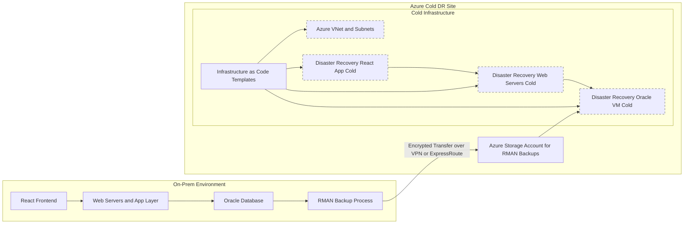

```mermaid
flowchart LR

%% ===================== ON-PREM =====================
subgraph OnPrem[On-Prem Environment]
    FE[React Frontend]
    APP[Web Servers and App Layer]
    DB[Oracle Database]
    RMAN[RMAN Backup Process]

    FE --> APP --> DB
    DB --> RMAN
end

%% ===================== BACKUP TRANSFER =====================
RMAN -->|Encrypted Transfer over VPN or ExpressRoute| STORAGE

%% ===================== AZURE COLD DR =====================
subgraph Azure[Azure Cold DR Site]

    STORAGE[Azure Storage Account for RMAN Backups]

    subgraph ColdInfra[Cold Infrastructure]
        IAC[Infrastructure as Code Templates]
        NET[Azure VNet and Subnets]
        DRFE[Disaster Recovery React App Cold]
        DRAPP[Disaster Recovery Web Servers Cold]
        DRDB[Disaster Recovery Oracle VM Cold]
    end

    IAC --> NET
    IAC --> DRFE
    IAC --> DRAPP
    IAC --> DRDB

    STORAGE --> DRDB
    DRFE --> DRAPP --> DRDB
end

%% ===================== STYLE =====================
classDef cold stroke-dasharray:5 5,stroke:#555;
class NET,DRFE,DRAPP,DRDB cold;
```
