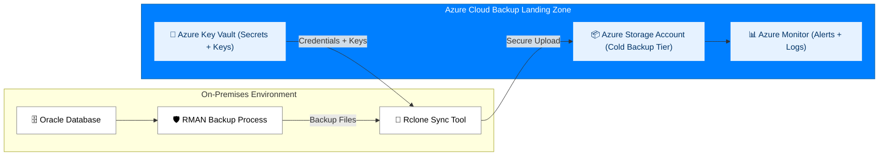

```mermaid
flowchart LR

    %% --- Azure Colors ---
    classDef azureBlue fill:#007FFF,stroke:#005A9E,color:#ffffff;
    classDef lightBlue fill:#E6F2FF,stroke:#007FFF,color:#003366;
    classDef neutral fill:#ffffff,stroke:#888888,color:#000;

    %% --- On-Prem Environment ---
    subgraph OnPrem["On-Premises Environment"]
        DB["🗄️ Oracle Database"]
        RMAN["🛡️ RMAN Backup Process"]
        RCLONE["🔁 Rclone Sync Tool"]
    end

    %% --- Azure Cloud ---
    subgraph Azure["Azure Cloud Backup Landing Zone"]
        SA["📦 Azure Storage Account (Cold Backup Tier)"]
        KEYVAULT["🔐 Azure Key Vault (Secrets + Keys)"]
        MON["📊 Azure Monitor (Alerts + Logs)"]
    end

    %% --- Flow ---
    DB --> RMAN
    RMAN -->|"Backup Files"| RCLONE
    RCLONE -->|"Secure Upload"| SA
    SA --> MON
    KEYVAULT -->|"Credentials + Keys"| RCLONE

    %% --- Apply Azure Colors ---
    class DB,RMAN,RCLONE neutral;
    class SA,KEYVAULT,MON lightBlue;
    class Azure azureBlue;
```
