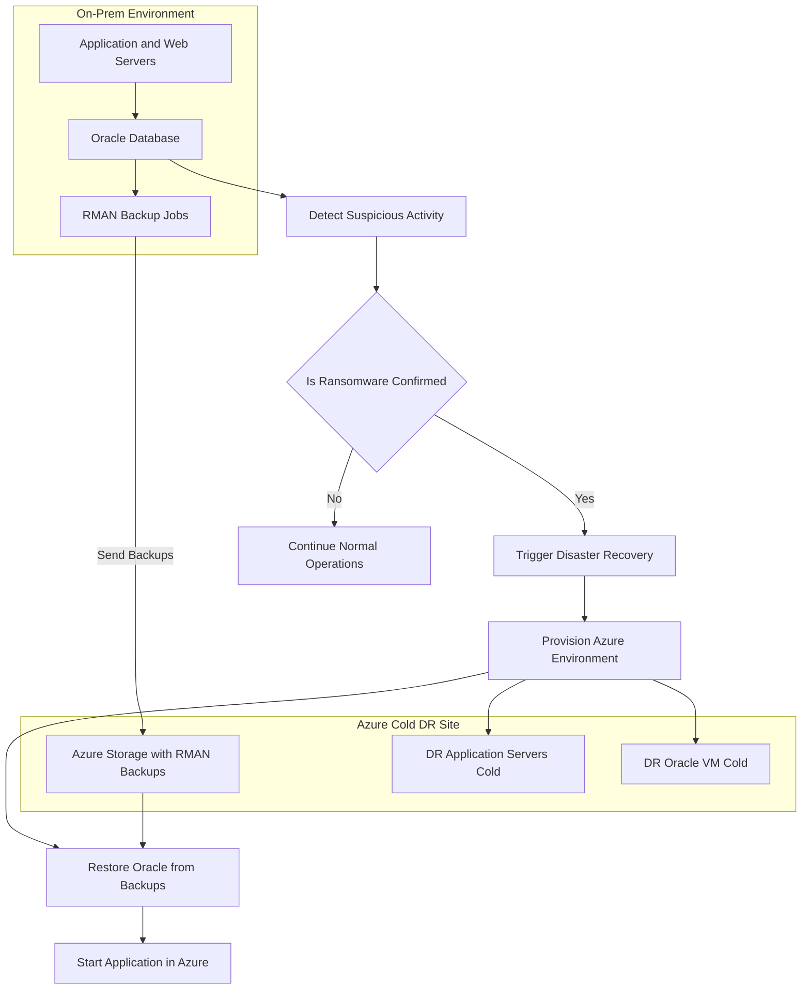

```mermaid
flowchart TD

%% ===================== NORMAL OPERATIONS =====================
subgraph OnPrem[On-Prem Environment]
    APP[Application and Web Servers]
    DB[Oracle Database]
    RMAN[RMAN Backup Jobs]
end

APP --> DB
DB --> RMAN

RMAN -->|Send Backups| AZStorage

%% ===================== RANSOMWARE DETECTION =====================
DB --> Detect[Detect Suspicious Activity]

Detect --> Check{Is Ransomware Confirmed}

Check -->|No| Continue[Continue Normal Operations]

%% ===================== ACTIVATION PATH =====================
Check -->|Yes| Activate[Trigger Disaster Recovery]

Activate --> Deploy[Provision Azure Environment]

Deploy --> Restore[Restore Oracle from Backups]

Restore --> StartDR[Start Application in Azure]

%% ===================== AZURE =====================
subgraph Azure[Azure Cold DR Site]
    AZStorage[Azure Storage with RMAN Backups]
    DRApp[DR Application Servers Cold]
    DRDB[DR Oracle VM Cold]
end

Deploy --> DRApp
Deploy --> DRDB
AZStorage --> Restore
```
