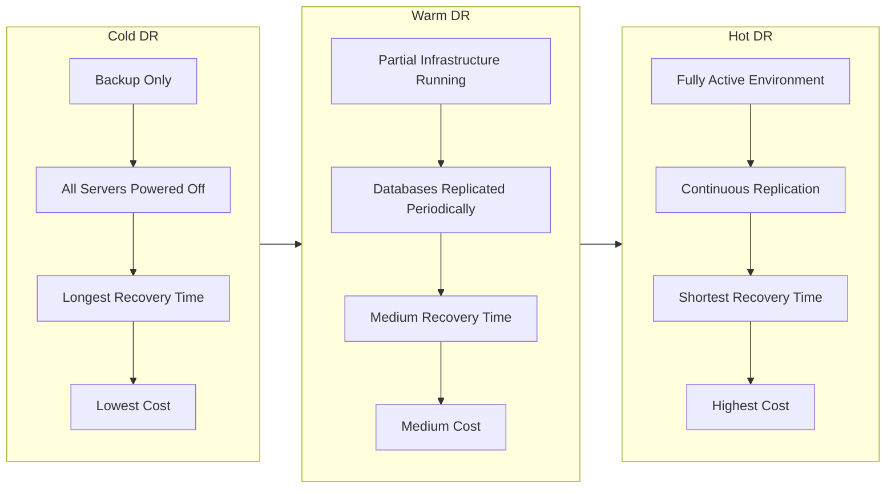

```mermaid
flowchart LR

%% ===================== COLD DR =====================
subgraph ColdDR[Cold DR]
    C1[Backup Only]
    C2[All Servers Powered Off]
    C3[Longest Recovery Time]
    C4[Lowest Cost]
end

C1 --> C2 --> C3 --> C4

%% ===================== WARM DR =====================
subgraph WarmDR[Warm DR]
    W1[Partial Infrastructure Running]
    W2[Databases Replicated Periodically]
    W3[Medium Recovery Time]
    W4[Medium Cost]
end

W1 --> W2 --> W3 --> W4

%% ===================== HOT DR =====================
subgraph HotDR[Hot DR]
    H1[Fully Active Environment]
    H2[Continuous Replication]
    H3[Shortest Recovery Time]
    H4[Highest Cost]
end

H1 --> H2 --> H3 --> H4

%% ===================== VISUAL RELATIONSHIP =====================
ColdDR --> WarmDR --> HotDR
```
