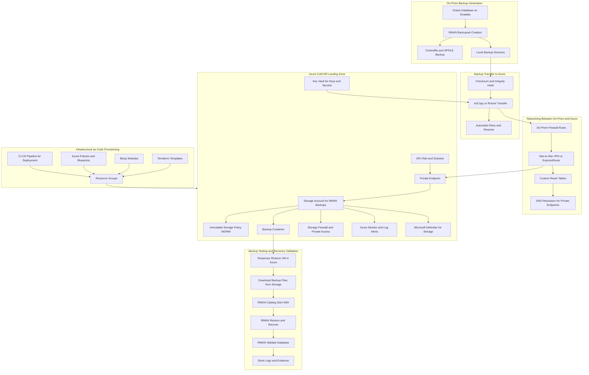

```mermaid
flowchart TB

%% ===========================
%% 1. BACKUP GENERATION
%% ===========================
subgraph A[On-Prem Backup Generation]
    DB[Oracle Database on Exadata]
    RMAN[RMAN Backupset Creation]
    SPFILE[Controlfile and SPFILE Backup]
    BDIR[Local Backup Directory]
end

DB --> RMAN --> BDIR
RMAN --> SPFILE

%% ===========================
%% 2. BACKUP TRANSFER
%% ===========================
subgraph B[Backup Transfer to Azure]
    HASH[Checksum and Integrity Hash]
    AZCOPY[AzCopy or Rclone Transfer]
    RETRY[Automatic Retry and Resume]
end

BDIR --> HASH --> AZCOPY --> RETRY

%% ===========================
%% 3. HYBRID NETWORKING
%% ===========================
subgraph C[Networking Between On-Prem and Azure]
    FW[On-Prem Firewall Rules]
    VPN[Site-to-Site VPN or ExpressRoute]
    ROUTES[Custom Route Tables]
    DNS[DNS Resolution for Private Endpoints]
end

AZCOPY --> FW --> VPN --> ROUTES --> DNS

%% ===========================
%% 4. AZURE LANDING ZONE
%% ===========================
subgraph D[Azure Cold DR Landing Zone]
    SA[Storage Account for RMAN Backups]
    IMMUTABLE[Immutable Storage Policy WORM]
    CONTAINER[Backup Container]
    PE[Private Endpoint]
    KV[Key Vault for Keys and Secrets]
    SEC[Storage Firewall and Private Access]
    MON[Azure Monitor and Log Alerts]
    DEFENDER[Microsoft Defender for Storage]
    VNET[DR VNet and Subnets]
end

VPN --> PE --> SA --> CONTAINER
SA --> IMMUTABLE
SA --> SEC
SA --> MON
SA --> DEFENDER
KV --> AZCOPY
VNET --> PE

%% ===========================
%% 5. TESTING & RESTORE
%% ===========================
subgraph E[Backup Testing and Recovery Validation]
    RESTVM[Temporary Restore VM in Azure]
    DOWNLOAD[Download Backup Files from Storage]
    CATALOG[RMAN Catalog Start With]
    RESTORE[RMAN Restore and Recover]
    VALIDATE[RMAN Validate Database]
    LOGS[Store Logs and Evidence]
end

CONTAINER --> RESTVM --> DOWNLOAD --> CATALOG --> RESTORE --> VALIDATE --> LOGS

%% ===========================
%% 6. PROVISIONING VIA IAC
%% ===========================
subgraph F[Infrastructure as Code Provisioning]
    TF[Terraform Templates]
    BICEP[Bicep Modules]
    RG[Resource Groups]
    POLICY[Azure Policies and Blueprints]
    PIPE[CI-CD Pipeline for Deployment]
end

TF --> RG
BICEP --> RG
POLICY --> RG
PIPE --> RG

RG --> D
```
