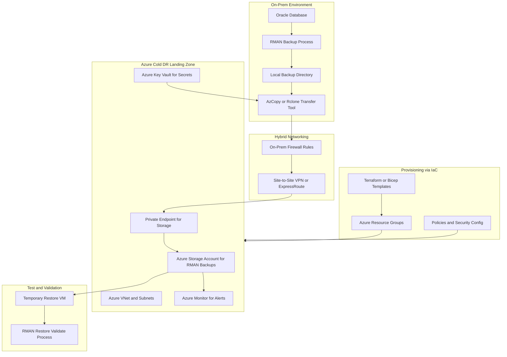

```mermaid
flowchart TB

    %% ======== ON-PREM SECTION ========
    subgraph ONPREM[On-Prem Environment]
        DB[Oracle Database]
        RMAN[RMAN Backup Process]
        LOCALFS[Local Backup Directory]
        AZCOPY[AzCopy or Rclone Transfer Tool]
    end

    DB --> RMAN --> LOCALFS --> AZCOPY

    %% ======== NETWORKING LAYER ========
    subgraph NET[Hybrid Networking]
        VPN[Site-to-Site VPN or ExpressRoute]
        FW[On-Prem Firewall Rules]
    end

    AZCOPY --> FW --> VPN

    %% ======== AZURE LANDING ZONE ========
    subgraph AZURE[Azure Cold DR Landing Zone]
        SA[Azure Storage Account for RMAN Backups]
        KV[Azure Key Vault for Secrets]
        PE[Private Endpoint for Storage]
        VNET[Azure VNet and Subnets]
        MON[Azure Monitor for Alerts]
    end

    VPN --> PE --> SA
    KV --> AZCOPY
    SA --> MON

    %% ======== TESTING AND RECOVERY ========
    subgraph TEST[Test and Validation]
        RESTVM[Temporary Restore VM]
        RESTORE[RMAN Restore Validate Process]
    end

    SA --> RESTVM --> RESTORE

    %% ======== DEPLOYMENT/IAC ========
    subgraph IAC[Provisioning via IaC]
        TF[Terraform or Bicep Templates]
        RG[Azure Resource Groups]
        POL[Policies and Security Config]
    end

    TF --> RG --> AZURE
    POL --> AZURE
```
