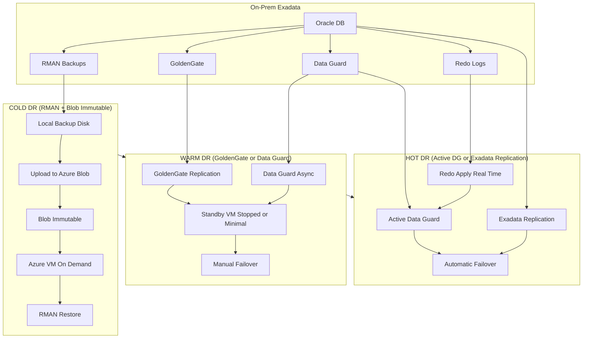

## Cold

❄ 1. COLD DR – RMAN → Azure Blob Immutable

Tools
- RMAN
- Local backup disk / backup appliance
- Rclone or AzCopy
- Azure Blob immutable (WORM)
- Azure VM + Oracle installed
- RMAN restore

How it works
	1.	RMAN produces .bkp backup sets on local storage.
	2.	Rclone/AzCopy uploads them to Azure Blob (immutable).
	3.	No compute runs in Azure.
	4.	During ransomware:
	•	Deploy Azure VMs
	•	Restore RMAN backups
	•	Start DB

Cost

Lowest.

⸻

🌤 2. WARM DR – GoldenGate or Data Guard (Async)

Tools
- GoldenGate
- Data Guard (async mode)
- Azure VM running Oracle
- Standby DB mounted but not open
- Manual switchover

How it works
	1.	GoldenGate sends DML changes to Azure.
	2.	OR Data Guard ships redo logs asynchronously.
	3.	A standby Oracle VM exists but is stopped or small-sized.
	4.	On failover:
	•	Apply logs
	•	Open DB
	•	Redirect apps

Cost

Medium.

⸻

🔥 3. HOT DR – Active Data Guard or Exadata Replication

Tools
- Active Data Guard (real-time apply)
- Zero-lag redo transport
- Exadata Cloud Service or ExaCC
- Fast Start Failover (FSFO)

How it works
	1.	Redo logs transmitted in real time.
	2.	Standby DB is always open for read.
	3.	Failover is automatic and instant if primary fails.

Cost

Highest.
