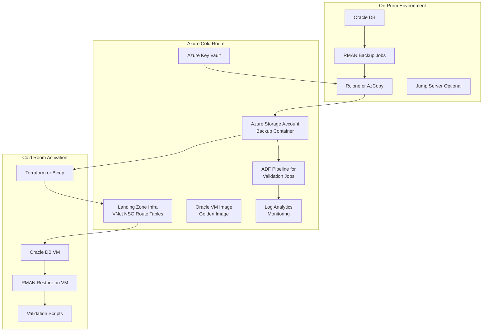
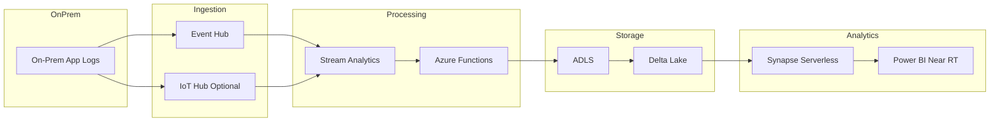
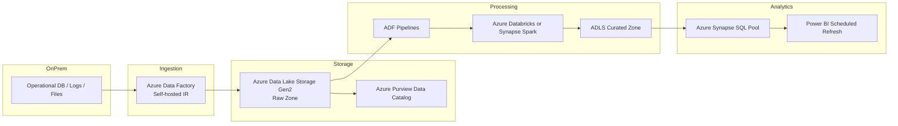

## Cold

```mermaid
flowchart TB

    subgraph OnPrem["On-Prem Environment"]
        DB[Oracle DB]
        RMAN[RMAN Backup Jobs]
        RCLONE[Rclone or AzCopy]
        GWS[Jump Server Optional]
    end

    DB --> RMAN --> RCLONE

    subgraph AzureLanding["Azure Cold Room"]
        SA[Azure Storage Account\nBackup Container]
        KV[Azure Key Vault]
        ELZ[Landing Zone Infra\nVNet NSG Route Tables]
        VMIMG[Oracle VM Image\nGolden Image]
        ADF[ADF Pipeline for\nValidation Jobs]
        LOG[Log Analytics\nMonitoring]
    end

    RCLONE --> SA
    KV --> RCLONE
    SA --> ADF --> LOG

    subgraph ColdRoomActivation["Cold Room Activation"]
        TERRAFORM[Terraform or Bicep]
        ORAVM[Oracle DB VM]
        RESTORE[RMAN Restore on VM]
        TEST[Validation Scripts]
    end

    SA --> TERRAFORM
    TERRAFORM --> ELZ --> ORAVM
    ORAVM --> RESTORE --> TEST
```
## Warm

```mermaid
flowchart LR
    subgraph OnPrem
        A[On-Prem App Logs]
    end

    subgraph Ingestion
        B[Event Hub]
        C[IoT Hub Optional]
    end

    subgraph Processing
        D[Stream Analytics]
        E[Azure Functions]
    end

    subgraph Storage
        F[ADLS]
        G[Delta Lake]
    end

    subgraph Analytics
        H[Synapse Serverless]
        I[Power BI Near RT]
    end

    A --> B --> D --> E --> F --> G --> H --> I
    A --> C --> D
```

## Hot

```mermaid
flowchart LR
    subgraph OnPrem
        A[Operational DB / Logs / Files]
    end

    subgraph Ingestion
        B[Azure Data Factory\nSelf-hosted IR]
    end

    subgraph Storage
        C[Azure Data Lake Storage Gen2\nRaw Zone]
        D[Azure Purview Data Catalog]
    end

    subgraph Processing
        E[ADF Pipelines]
        F[Azure Databricks or Synapse Spark]
        G[ADLS Curated Zone]
    end

    subgraph Analytics
        H[Azure Synapse SQL Pool]
        I[Power BI Scheduled Refresh]
    end

    A --> B --> C --> D
    C --> E --> F --> G --> H --> I
```
