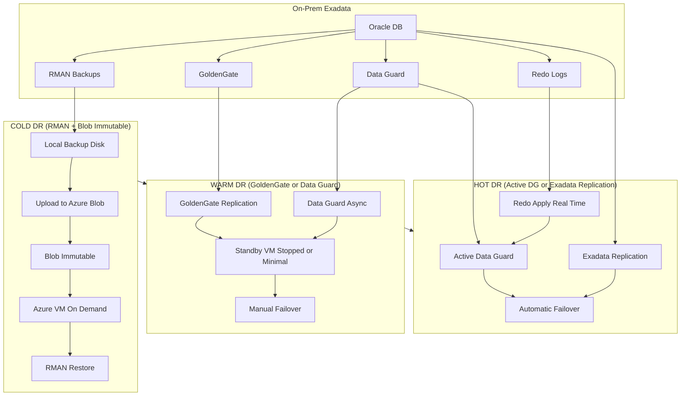

## Cold

```mermaid
flowchart TB

%% ------------------------
%% ON-PREM ORACLE EXADATA
%% ------------------------
subgraph ONPREM["On-Prem Exadata"]
    DB[Oracle DB]
    RMAN[RMAN Backups]
    GG[GoldenGate]
    DG[Data Guard]
    REDO[Redo Logs]
end

DB --> RMAN
DB --> GG
DB --> DG
DB --> REDO

%% ------------------------
%% COLD DR
%% ------------------------
subgraph COLD["COLD DR (RMAN + Blob Immutable)"]
    C1[Local Backup Disk]
    C2[Upload to Azure Blob]
    C3[Blob Immutable]
    C4[Azure VM On Demand]
    C5[RMAN Restore]
end

RMAN --> C1 --> C2 --> C3
C3 --> C4 --> C5

%% ------------------------
%% WARM DR
%% ------------------------
subgraph WARM["WARM DR (GoldenGate or Data Guard)"]
    W1[GoldenGate Replication]
    W2[Data Guard Async]
    W3[Standby VM Stopped or Minimal]
    W4[Manual Failover]
end

GG --> W1 --> W3
DG --> W2 --> W3
W3 --> W4

%% ------------------------
%% HOT DR
%% ------------------------
subgraph HOT["HOT DR (Active DG or Exadata Replication)"]
    H1[Active Data Guard]
    H2[Redo Apply Real Time]
    H3[Exadata Replication]
    H4[Automatic Failover]
end

REDO --> H2 --> H1 --> H4
DG --> H1
DB --> H3 --> H4

%% FLOW ORDER
COLD --> WARM --> HOT
```
