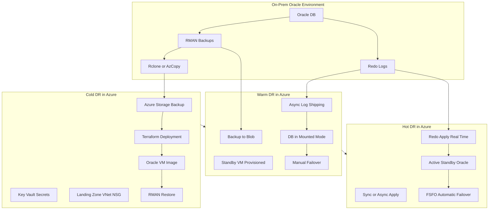

## Cold

```mermaid
flowchart TB

%% =======================
%% ON-PREM COMMON
%% =======================
subgraph OnPrem["On-Prem Oracle Environment"]
    OPDB[Oracle DB]
    OPRMAN[RMAN Backups]
    OPRCLONE[Rclone or AzCopy]
    OPREDO[Redo Logs]
end

OPDB --> OPRMAN
OPDB --> OPREDO

%% =======================
%% COLD DR
%% =======================
subgraph COLD["Cold DR in Azure"]
    C1[Azure Storage Backup]
    C2[Key Vault Secrets]
    C3[Landing Zone VNet NSG]
    C4[Oracle VM Image]
    C5[Terraform Deployment]
    C6[RMAN Restore]
end

OPRMAN --> OPRCLONE --> C1
C1 --> C5 --> C4 --> C6

%% =======================
%% WARM DR
%% =======================
subgraph WARM["Warm DR in Azure"]
    W1[Backup to Blob]
    W2[Async Log Shipping]
    W3[Standby VM Provisioned]
    W4[DB in Mounted Mode]
    W5[Manual Failover]
end

OPRMAN --> W1
OPREDO --> W2
W2 --> W4
W4 --> W5

%% =======================
%% HOT DR
%% =======================
subgraph HOT["Hot DR in Azure"]
    H1[Active Standby Oracle]
    H2[Redo Apply Real Time]
    H3[Sync or Async Apply]
    H4[FSFO Automatic Failover]
end

OPREDO --> H2 --> H1
H1 --> H4

%% =======================
%% VISUAL FLOW ORDER
%% =======================
COLD --> WARM --> HOT
```
