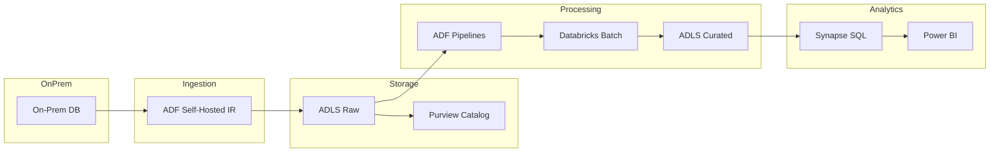
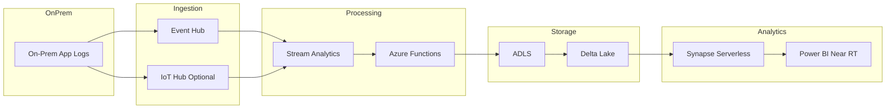
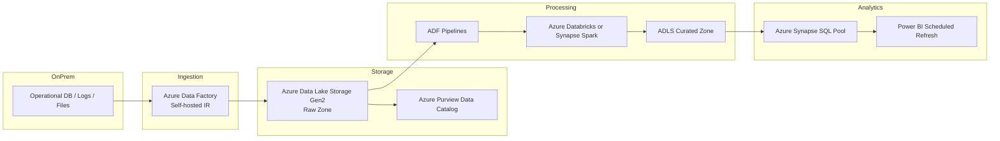

## Cold

```mermaid
flowchart LR
    subgraph OnPrem
        A[On-Prem DB]
    end

    subgraph Ingestion
        B[ADF Self-Hosted IR]
    end

    subgraph Storage
        C[ADLS Raw]
        D[Purview Catalog]
    end

    subgraph Processing
        E[ADF Pipelines]
        F[Databricks Batch]
        G[ADLS Curated]
    end

    subgraph Analytics
        H[Synapse SQL]
        I[Power BI]
    end

    A --> B --> C --> D
    C --> E --> F --> G --> H --> I
```
## Warm

```mermaid
flowchart LR
    subgraph OnPrem
        A[On-Prem App Logs]
    end

    subgraph Ingestion
        B[Event Hub]
        C[IoT Hub Optional]
    end

    subgraph Processing
        D[Stream Analytics]
        E[Azure Functions]
    end

    subgraph Storage
        F[ADLS]
        G[Delta Lake]
    end

    subgraph Analytics
        H[Synapse Serverless]
        I[Power BI Near RT]
    end

    A --> B --> D --> E --> F --> G --> H --> I
    A --> C --> D
```

## Hot

```mermaid
flowchart LR
    subgraph OnPrem
        A[Operational DB / Logs / Files]
    end

    subgraph Ingestion
        B[Azure Data Factory\nSelf-hosted IR]
    end

    subgraph Storage
        C[Azure Data Lake Storage Gen2\nRaw Zone]
        D[Azure Purview Data Catalog]
    end

    subgraph Processing
        E[ADF Pipelines]
        F[Azure Databricks or Synapse Spark]
        G[ADLS Curated Zone]
    end

    subgraph Analytics
        H[Azure Synapse SQL Pool]
        I[Power BI Scheduled Refresh]
    end

    A --> B --> C --> D
    C --> E --> F --> G --> H --> I
```
