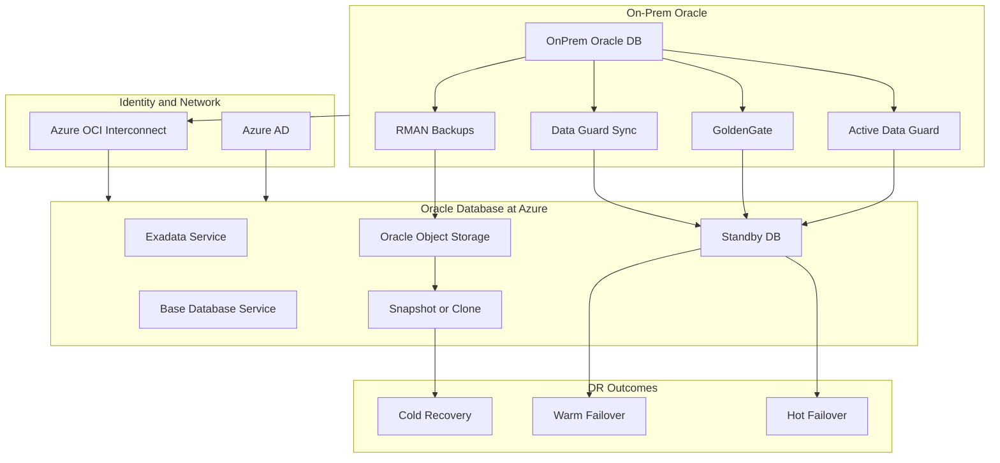

```mermaid
flowchart TB

%% ===========================
%% ON-PREM
%% ===========================
subgraph OnPrem ["On-Prem Oracle"]
    DB[OnPrem Oracle DB]
    RMAN[RMAN Backups]
    DG[Data Guard Sync]
    ADG[Active Data Guard]
    GG[GoldenGate]
end

%% ===========================
%% ORACLE DATABASE @ AZURE
%% ===========================
subgraph ODAZ ["Oracle Database at Azure"]
    EXA[Exadata Service]
    BASE[Base Database Service]
    STANDBY[Standby DB]
    OBJ[Oracle Object Storage]
    CLONE[Snapshot or Clone]
end

%% ===========================
%% NETWORKING & IDENTITY
%% ===========================
subgraph Network ["Identity and Network"]
    INT[Azure OCI Interconnect]
    AAD[Azure AD]
end

%% ===========================
%% DR MODES
%% ===========================
subgraph DR ["DR Outcomes"]
    COLD[Cold Recovery]
    WARM[Warm Failover]
    HOT[Hot Failover]
end

%% CONNECTIONS
DB --> RMAN --> OBJ --> CLONE --> COLD
DB --> DG --> STANDBY --> WARM
DB --> GG --> STANDBY
DB --> ADG --> STANDBY --> HOT

OnPrem --> INT --> ODAZ
AAD --> ODAZ
```
