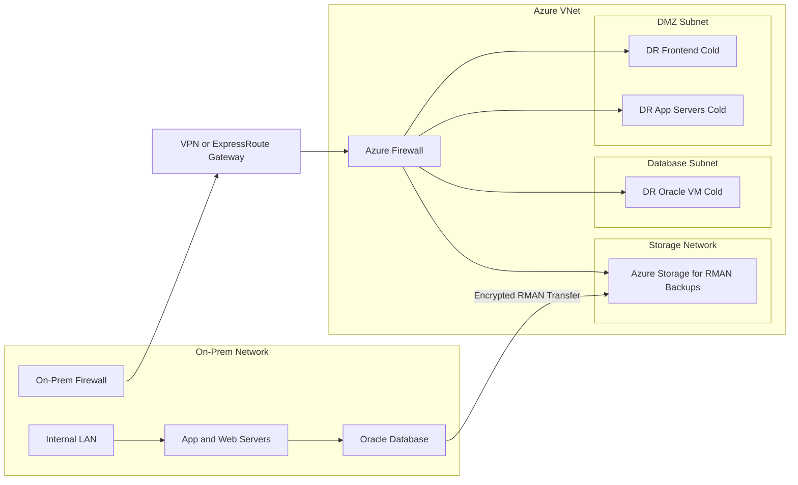

```mermaid
flowchart LR

%% -------------------- ON-PREM NETWORK --------------------
subgraph OnPrem[On-Prem Network]
    ONFW[On-Prem Firewall]
    ONLAN[Internal LAN]
    ONAPP[App and Web Servers]
    ONDB[Oracle Database]

    ONLAN --> ONAPP --> ONDB
end

%% -------------------- CONNECTIVITY --------------------
ONFW --> VPNGW

VPNGW[VPN or ExpressRoute Gateway] --> AZFW

%% -------------------- AZURE NETWORK --------------------
subgraph Azure[Azure VNet]
    AZFW[Azure Firewall]

    subgraph Subnet1[DMZ Subnet]
        DRFE[DR Frontend Cold]
        DRAPP[DR App Servers Cold]
    end

    subgraph Subnet2[Database Subnet]
        DRDB[DR Oracle VM Cold]
    end

    subgraph StorageNet[Storage Network]
        AZStorage[Azure Storage for RMAN Backups]
    end

    AZFW --> DRFE
    AZFW --> DRAPP
    AZFW --> DRDB
    AZFW --> AZStorage
end

%% -------------------- BACKUP FLOW --------------------
ONDB -->|Encrypted RMAN Transfer| AZStorage
```
