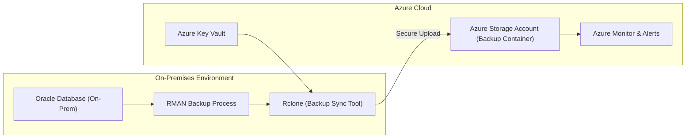

```mermaid
flowchart LR

    subgraph OnPrem["On-Premises Environment"]
        DB["Oracle Database (On-Prem)"]
        RMAN["RMAN Backup Process"]
        RCLONE["Rclone (Backup Sync Tool)"]
    end

    subgraph Azure["Azure Cloud"]
        SA["Azure Storage Account (Backup Container)"]
        VAULT["Azure Key Vault"]
        MON["Azure Monitor & Alerts"]
    end

    DB --> RMAN
    RMAN --> RCLONE
    RCLONE -->|"Secure Upload"| SA
    SA --> MON
    VAULT --> RCLONE
```
