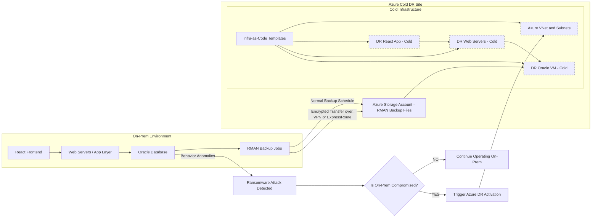

```mermaid
flowchart LR

%% ================= ON-PREM =================
subgraph OnPrem[On-Prem Environment]
    FE[React Frontend]
    WS[Web Servers / App Layer]
    ORA[Oracle Database]
    BACKUP[RMAN Backup Jobs]

    FE --> WS --> ORA
    ORA --> BACKUP
end

%% ================= RANSOMWARE PATH =================
RANSOMWARE[Ransomware Attack Detected]

BACKUP -->|Normal Backup Schedule| AZStorage
ORA -->|Behavior Anomalies| RANSOMWARE

%% ================= ACTIVATION DECISION =================
RANSOMWARE --> DECIDE{Is On-Prem Compromised?}

DECIDE -->|NO| CONTINUE[Continue Operating On-Prem]
DECIDE -->|YES| ACTIVATE[Trigger Azure DR Activation]

%% ================= CONNECTIVITY =================
BACKUP -->|Encrypted Transfer over VPN or ExpressRoute| AZStorage

%% ================= AZURE COLD DR =================
subgraph Azure[Azure Cold DR Site]
    AZStorage[Azure Storage Account - RMAN Backup Files]

    subgraph ColdInfra[Cold Infrastructure]
        ARM[Infra-as-Code Templates]
        DRNet[Azure VNet and Subnets]
        DRFE[DR React App - Cold]
        DRWS[DR Web Servers - Cold]
        DRORA[DR Oracle VM - Cold]
    end

    ARM --> DRNet
    ARM --> DRFE
    ARM --> DRWS
    ARM --> DRORA

    AZStorage --> DRORA
    DRFE --> DRWS --> DRORA
end

ACTIVATE --> DRNet

%% ================= VISUAL STYLE FOR COLD RESOURCES =================
classDef cold stroke-dasharray: 5 5, stroke:#555;
class DRNet,DRFE,DRWS,DRORA cold;
```
