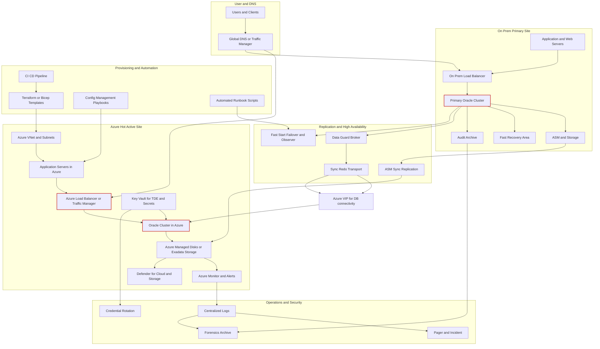

```mermaid
flowchart TB

%% ========== ON-PREM PRIMARY ==========
subgraph ONPREM[On Prem Primary Site]
    P_APP[Application and Web Servers]
    P_LB[On Prem Load Balancer]
    P_DB[Primary Oracle Cluster]
    P_ASM[ASM and Storage]
    P_FRA[Fast Recovery Area]
    P_AUDIT[Audit Archive]
end

P_APP --> P_LB --> P_DB
P_DB --> P_ASM
P_DB --> P_FRA
P_DB --> P_AUDIT

%% ========== REPLICATION & HIGH AVAILABILITY ==========
subgraph REPL[Replication and High Availability]
    DG[Data Guard Broker]
    FSFO[Fast Start Failover and Observer]
    SYNC[Sync Redo Transport]
    ASM_SYNC[ASM Sync Replication]
end

P_DB --> DG --> SYNC --> AZ_VIP
P_DB --> FSFO
P_ASM --> ASM_SYNC --> AZ_STORAGE

%% ========== AZURE HOT ACTIVE SITE ==========
subgraph AZURE[Azure Hot Active Site]
    AZ_VNET[Azure VNet and Subnets]
    AZ_LB[Azure Load Balancer or Traffic Manager]
    AZ_APP[Application Servers in Azure]
    AZ_DB_CLUSTER[Oracle Cluster in Azure]
    AZ_STORAGE[Azure Managed Disks or Exadata Storage]
    AZ_KEYVAULT[Key Vault for TDE and Secrets]
    AZ_MON[Azure Monitor and Alerts]
    AZ_DEFENDER[Defender for Cloud and Storage]
end

SYNC --> AZ_VIP[Azure VIP for DB connectivity]
AZ_VIP --> AZ_DB_CLUSTER
AZ_VNET --> AZ_APP --> AZ_LB --> AZ_DB_CLUSTER
AZ_DB_CLUSTER --> AZ_STORAGE
AZ_KEYVAULT --> AZ_DB_CLUSTER
AZ_STORAGE --> AZ_MON
AZ_STORAGE --> AZ_DEFENDER

%% ========== CLIENT ROUTING ==========
subgraph CLIENT[User and DNS]
    DNS[Global DNS or Traffic Manager]
    CLIENTS[Users and Clients]
end

CLIENTS --> DNS --> AZ_LB
DNS --> P_LB

%% ========== AUTOMATION AND PROVISIONING ==========
subgraph IAC[Provisioning and Automation]
    TF[Terraform or Bicep Templates]
    PIPE[CI CD Pipeline]
    ANSIBLE[Config Management Playbooks]
    RUNBOOK[Automated Runbook Scripts]
end

TF --> AZ_VNET
PIPE --> TF
ANSIBLE --> AZ_APP
RUNBOOK --> FSFO

%% ========== OPERATIONS ==========
subgraph OPS[Operations and Security]
    LOGS[Centralized Logs]
    ALERTS[Pager and Incident]
    ROTATE[Credential Rotation]
    AUDIT[Forensics Archive]
end

AZ_MON --> LOGS --> ALERTS
AZ_KEYVAULT --> ROTATE
P_AUDIT --> AUDIT
LOGS --> AUDIT

%% ========== STYLING ==========
classDef hot stroke:#c41f1f,stroke-width:2px;
class AZ_DB_CLUSTER,P_DB,AZ_LB hot;
```
