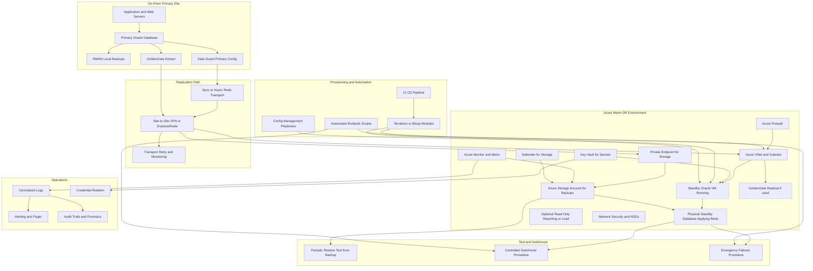

```mermaid
flowchart TB

%% ==========================
%% 1. ON-PREM PRIMARY SITE
%% ==========================
subgraph ONPREM[On-Prem Primary Site]
    P_APP[Application and Web Servers]
    P_DB[Primary Oracle Database]
    RMAN_P[RMAN Local Backups]
    DG_SRC[Data Guard Primary Config]
    GG_SRC[GoldenGate Extract]
end

P_APP --> P_DB
P_DB --> RMAN_P
P_DB --> DG_SRC
P_DB --> GG_SRC

%% ==========================
%% 2. REDO REPLICATION PATH
%% ==========================
subgraph REPL[Replication Path]
    SYNC[Sync or Async Redo Transport]
    NETWORK[Site-to-Site VPN or ExpressRoute]
    RETRY[Transport Retry and Monitoring]
end

DG_SRC --> SYNC --> NETWORK --> RETRY
GG_SRC --> NETWORK

%% ==========================
%% 3. AZURE WARM STANDBY
%% ==========================
subgraph AZURE[Azure Warm DR Environment]
    AZ_VNET[Azure VNet and Subnets]
    AZ_PE[Private Endpoint for Storage]
    AZ_SA[Azure Storage Account for Backups]
    STDBY_VM[Standby Oracle VM Running]
    STDBY_DB[Physical Standby Database Applying Redo]
    GG_REP[GoldenGate Replicat if used]
    LOAD[Optional Read Only Reporting or Load]
    KV[Key Vault for Secrets]
    MON[Azure Monitor and Alerts]
    SEC[Network Security and NSGs]
    FW[Azure Firewall]
    DEFENDER[Defender for Storage]
end

NETWORK --> AZ_PE --> AZ_SA
NETWORK --> AZ_VNET
AZ_VNET --> STDBY_VM --> STDBY_DB
AZ_VNET --> GG_REP
AZ_SA --> STDBY_DB
KV --> STDBY_VM
MON --> AZ_SA
FW --> AZ_VNET
DEFENDER --> AZ_SA

%% ==========================
%% 4. TESTING AND SWITCHOVER
%% ==========================
subgraph TEST[Test and Switchover]
    BACKUP_TEST[Periodic Restore Test from Backup]
    SWITCHO[Controlled Switchover Procedure]
    FAILOVER[Emergency Failover Procedure]
end

AZ_SA --> BACKUP_TEST
STDBY_DB --> SWITCHO
STDBY_DB --> FAILOVER

%% ==========================
%% 5. IAC AND AUTOMATION
%% ==========================
subgraph IAC[Provisioning and Automation]
    TF[Terraform or Bicep Modules]
    PIPE[CI CD Pipeline]
    ANSIBLE[Config Management Playbooks]
    DR_RUNBOOK[Automated Runbook Scripts]
end

TF --> AZ_VNET
TF --> STDBY_VM
PIPE --> TF
ANSIBLE --> STDBY_VM
DR_RUNBOOK --> SWITCHO
DR_RUNBOOK --> FAILOVER

%% ==========================
%% 6. OPERATIONS AND SECURITY
%% ==========================
subgraph OPS[Operations]
    LOGS[Centralized Logs]
    ALERTS[Alerting and Pager]
    ROTATE[Credential Rotation]
    AUDIT[Audit Trails and Forensics]
end

MON --> LOGS --> ALERTS
KV --> ROTATE
LOGS --> AUDIT

%% styling for warm resources
classDef warm stroke-dasharray: 2 2,stroke:#2b6fbf;
class STDBY_VM,STDBY_DB,GG_REP warm;
```
